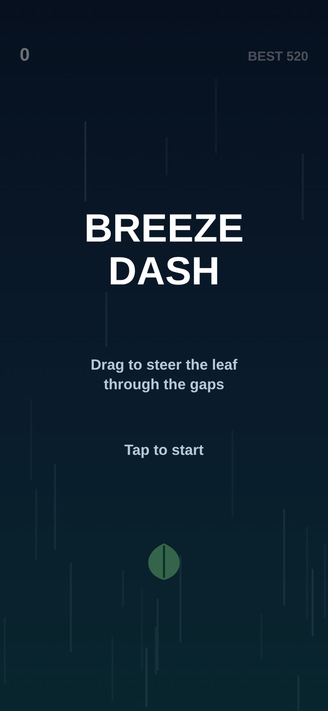
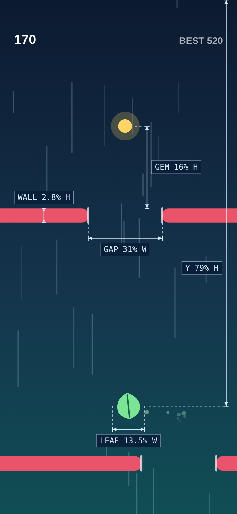
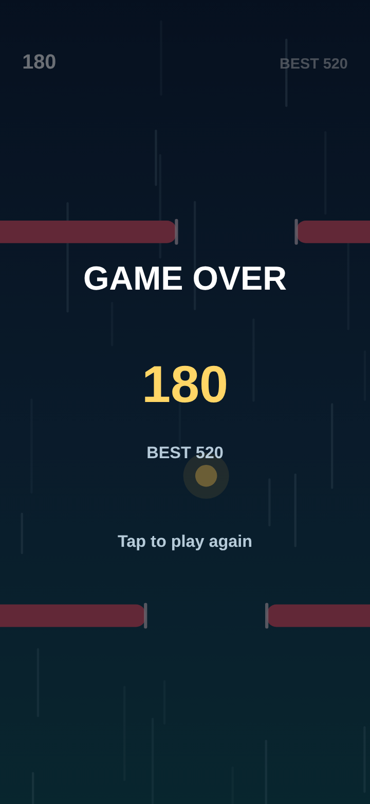

# Breeze Dash

A small one-finger Android arcade game. You steer a leaf on the breeze and thread
it through the gap in each falling wall, collecting gems and the occasional shield.

Written in Kotlin with nothing but the Android framework — the whole game is drawn
on a `SurfaceView` canvas from its own render thread. No game engine, no assets,
one runtime dependency (`androidx.core`).

## Preview

<p align="center">
  
  
  
</p>

These are drawn by the game code itself, not mocked up. The middle view is a real
autopilot run frozen at 12.6 seconds, annotated with the layout dimensions as
fractions of screen width (W) and height (H).

`docs/preview.html` is a playable browser port that follows `GameView.kt` rule for
rule: same speeds, gap widths, sizes and colours. Download it and open it in any
browser to try the game without installing the APK. After visual changes,
regenerate the images with `NODE_PATH="$(npm root -g)" node docs/render-screens.mjs`.

## How to play

| | |
|---|---|
| Steer | Drag anywhere on the screen; the leaf follows your finger |
| Start / restart | Tap |
| Pause | Back gesture, or leave the app |
| Gem (gold) | +25 points |
| Shield (blue) | Absorbs one wall hit, up to 3 stacked |
| Passing a wall | +10 points |

One hit without a shield ends the run. Your best score is saved locally.

Difficulty ramps for the first ~37 seconds: walls fall from 0.40 to 0.85 screen
heights per second, the gap narrows from 36% to 24% of the screen width, and the
spawn interval tightens from 1.05s to 0.52s. Consecutive gaps never shift by more
than 42% of the screen width, so every wall is reachable from the last one.

## Building

Requires JDK 17 and the Android SDK (API 34).

```bash
./gradlew assembleDebug          # APK at app/build/outputs/apk/debug/
./gradlew installDebug           # build and install on a connected device
```

Or open the project directory in Android Studio and press Run. If Gradle cannot
find your SDK, create a `local.properties` with `sdk.dir=/path/to/Android/sdk`
(Android Studio writes this for you on first sync).

- `minSdk` 26, `targetSdk`/`compileSdk` 34, portrait only
- No permissions, no network, no analytics

### Building without a PC

`.github/workflows/android.yml` builds the debug APK on every push and attaches
it to the workflow run, so you do not need a local Android SDK to get an
installable build:

1. Open the repository's **Actions** tab and pick the latest *Android CI* run.
2. Download the `breeze-dash-debug-<run number>` artifact and unzip it.
3. Install the APK on a device with "install unknown apps" enabled for your
   browser or file manager.

The APK is signed with the standard Android debug key, so it installs for
testing but cannot be published to Play.

## Layout

```
app/src/main/java/com/breeze/dash/
  MainActivity.kt   Activity host: fullscreen setup, loop start/stop, back handling
  GameView.kt       SurfaceView + render thread: simulation, collision, drawing
  Entities.kt       Barrier, Pickup, Particle, Streak
```

`GameView` owns all mutable state and touches it only from the render thread.
Input is recorded on the UI thread into `pendingTap` / `pendingTouchX` /
`pendingPause` and drained by `consumeInput()` at the top of each simulation
step, so the world is never mutated from two threads at once.
