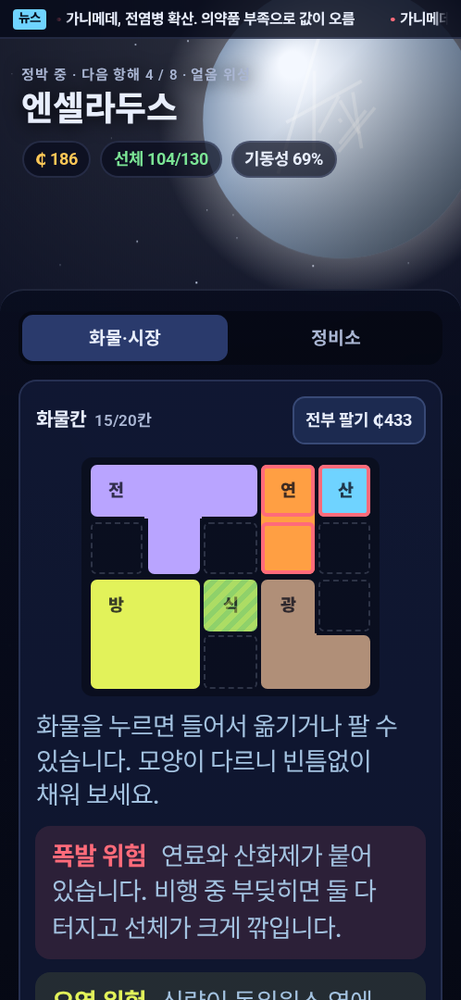
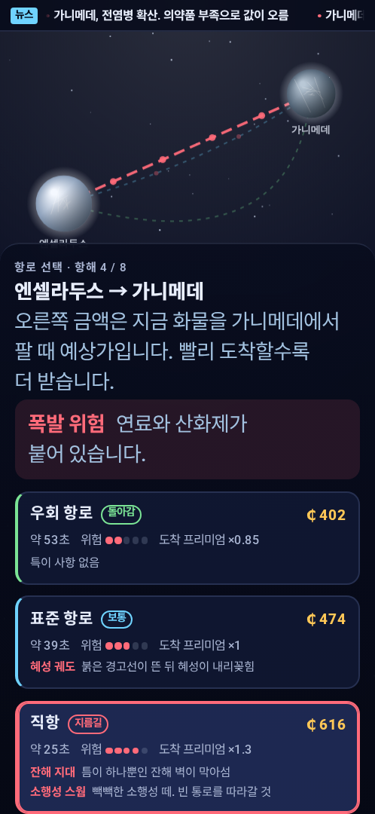
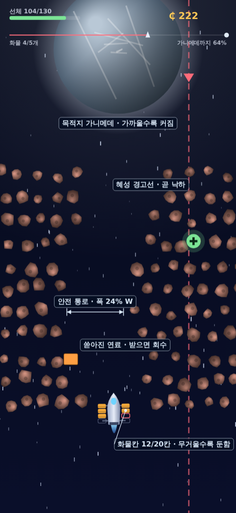
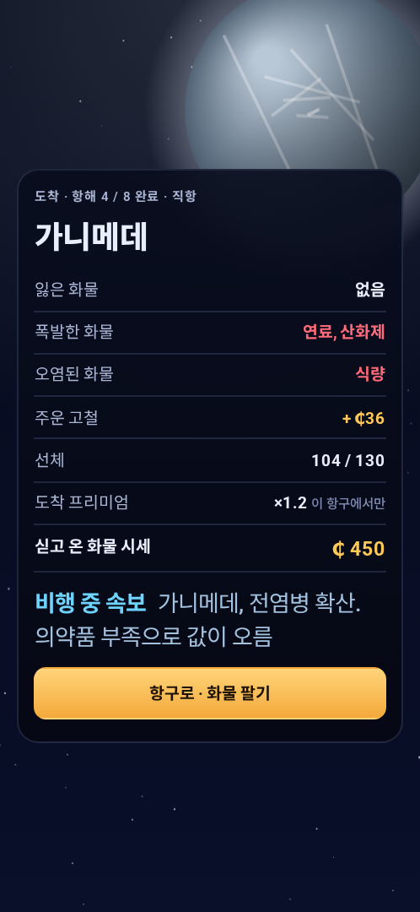

# Breeze Dash II

A space-freight roguelike for Android. Buy cheap, sell dear, and dodge your way
across eight planets to the Oort terminus. Cargo comes in shapes you have to fit
into the hold, the news moves prices, and losing the hull ends the run.

<p align="center">
  
  
  
  
</p>

These are drawn by the game code itself, not mocked up. `docs/preview.html` is
the same game with a live readout and balance tables; it is also published as a
private Claude artifact (see CLAUDE.md).

## The loop

1. **Port.** Sell what you carried, buy what the next planets want, and fit it
   into the hold grid (4×3 up to 6×5). Eight goods, each with its own footprint,
   weight and price. Tap a piece to pick it up, rotate it, move it or sell it.
   Spend credits on the engine, the hold (bigger grid, wider ship) and the hull.
2. **Route.** Three ways to the next planet. Cargo that arrives by the direct
   route sells ×1.3 at the port it lands at; by the detour, ×0.85. Faster routes
   are more dangerous and roll hazard traits: asteroid belt, debris walls, ion
   storms, asteroid swarms, comets.
3. **Flight.** Drag to steer. A hit spills one piece of cargo, which tumbles back
   past the ship and can be caught. Swarms always leave a safe lane, comets get a
   red warning line, and breaking news mid-flight can move prices ahead.
4. **Arrival.** Report of lost, exploded and contaminated cargo, then port.

### Cargo rules

- **Explosive pairs.** Fuel touching oxidizer blows up when the ship is hit:
  both pieces are destroyed and the hull takes 22 extra damage.
- **Contamination.** Food or medicine touching isotopes arrives worth 40%.
- **Weight.** Agility is engine thrust divided by mass; ore is heavy, medicine light.

### Markets and news

Each kind of world makes some goods cheaply and pays well for others (the
terminus buys everything high). The news ticker announces shortages (price
×1.45–1.8) and gluts (×0.55–0.7) at planets ahead, lasting 2–3 flights. Cargo
can be held across several flights to reach a better market.

A bot trading and flying the real game code, 40 runs per strategy, with
human-like reaction (re-decides every 0.22 s, sees 0.8 s ahead, aims with error):

| Strategy | Runs finished | Hits per flight | Pieces lost per flight | Avg final credits |
|---|---|---|---|---|
| Always detour | 40 / 40 | 0.61 | 0.25 | ₵880 |
| Always standard | 40 / 40 | 1.68 | 0.76 | ₵1,216 |
| Always direct | 40 / 40 | 2.48 | 1.41 | ₵2,251 |

## Architecture

The game is one HTML/JavaScript source in `app/src/main/assets/game/`
(`game.js`, `game.css`, `index.html`). `MainActivity` runs it in a WebView, served
from a virtual https origin through `WebViewAssetLoader` so web storage (run
save, best score) works without file access or network permission. The Android
back button and `onPause` call into the page (`breezeBack`, `breezePause`).

`docs/preview.html` is generated by `docs/build-preview.mjs`, which inlines the
same files into `docs/preview.template.html`. So the phone build and the browser
preview cannot drift apart.

Version 1 (the native Kotlin leaf-dodging game) is commit `d5dd319`.

## Building

Requires JDK 17 and the Android SDK (API 34).

```bash
./gradlew assembleDebug          # APK at app/build/outputs/apk/debug/
```

Every push also builds the APK in GitHub Actions (`.github/workflows/android.yml`,
which first syntax-checks `game.js`); download it from the run's artifacts.

Preview and screenshots:

```bash
node docs/build-preview.mjs                                # docs/preview.html
NODE_PATH="$(npm root -g)" node docs/render-screens.mjs    # docs/screens/*.png
```

- `minSdk` 26, `targetSdk`/`compileSdk` 34, portrait only
- No permissions, no network, no analytics
